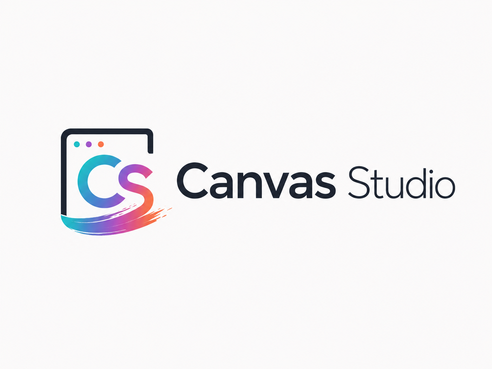
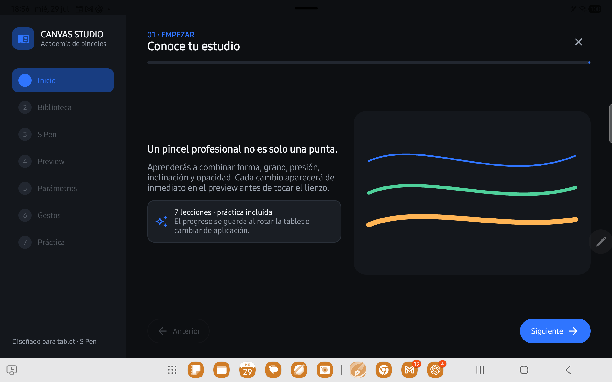
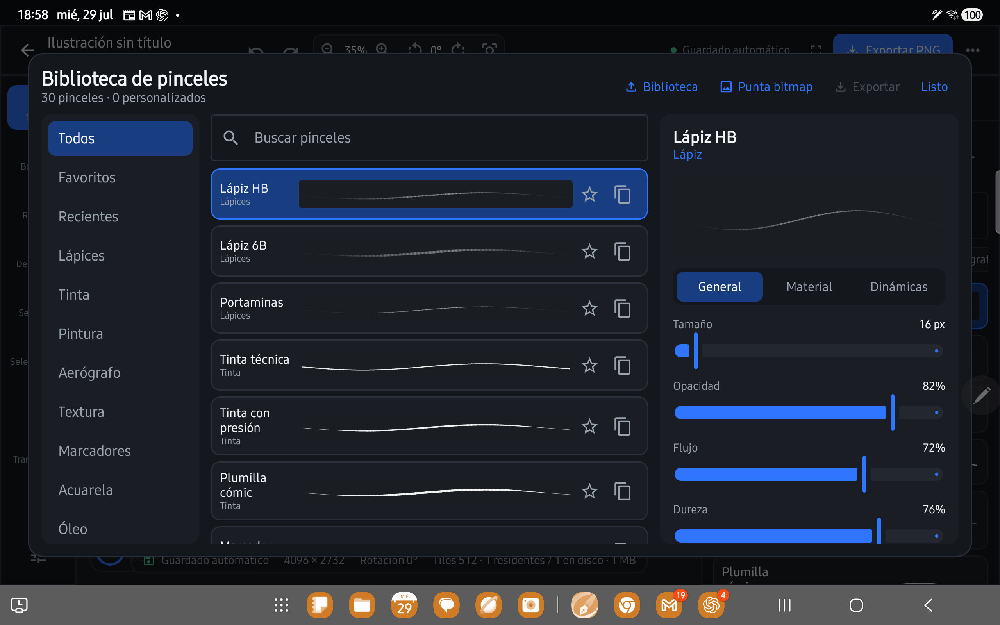
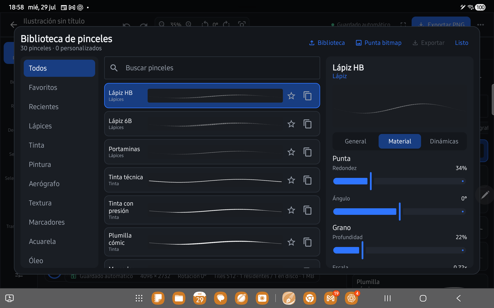
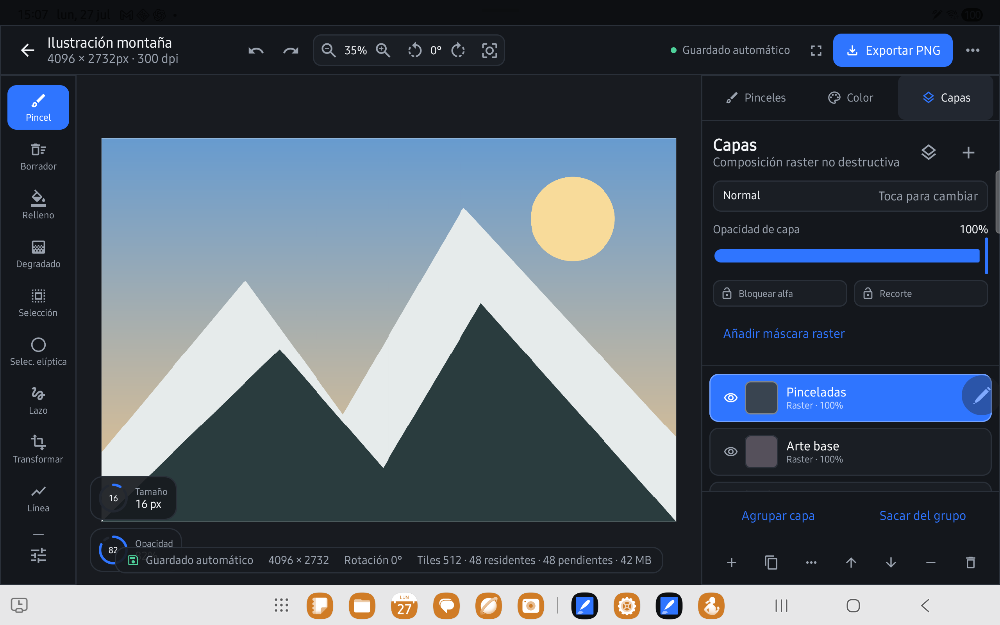
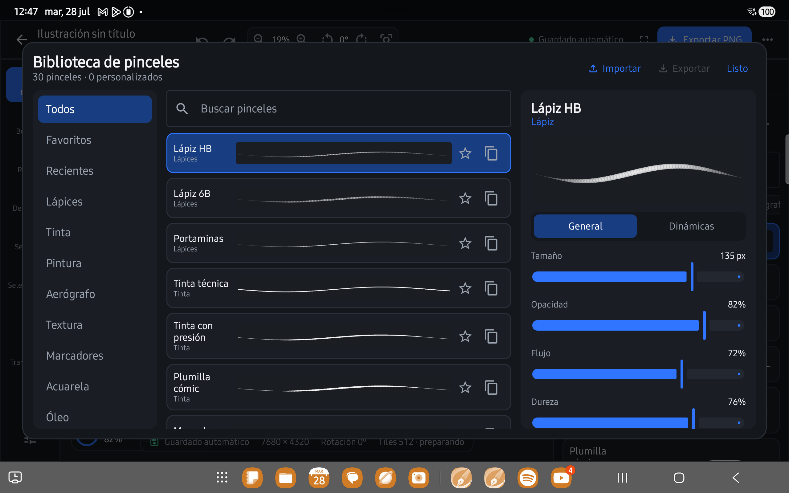
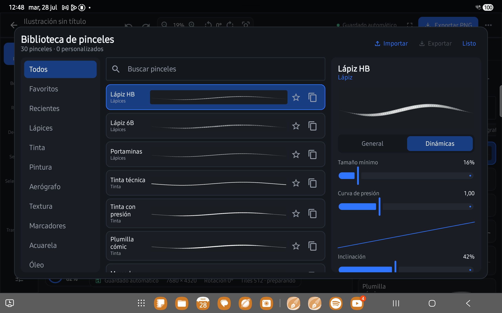
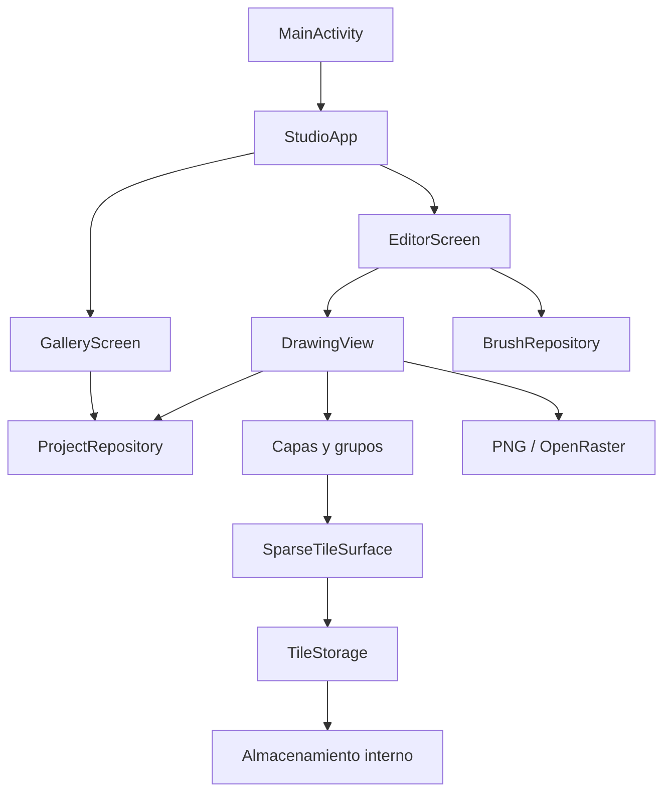

# Canvas Studio

Aplicación Android **local-first** de dibujo, pintura e ilustración digital, diseñada principalmente para tablets y lápices sensibles a presión como el S Pen.

Canvas Studio combina una interfaz adaptativa creada con Jetpack Compose con un motor raster propio basado en tiles. El objetivo del proyecto es ofrecer una experiencia de dibujo profesional, rápida y sin dependencia de cuentas, servidores ni conexión permanente a Internet. La interfaz está diseñada exclusivamente para tablets: requiere un ancho disponible mínimo de `600dp` y no se distribuye para teléfonos.

> **Estado del proyecto:** Release candidate para tablets / fase 9.1
> **Versión incluida en este repositorio:** `2.2.0`
> **Formato de documento actual:** v7  
> **Plataforma:** tablets Android 8.0 o superior (mínimo `sw600dp`)



## Capturas en dispositivo real

Las siguientes capturas fueron obtenidas directamente de una Samsung Galaxy Tab S8 (`SM-X700`). Muestran la interfaz de tablet y el lienzo con trazos reales; no son renders promocionales.














---

## Contenido

- [Visión general](#visión-general)
- [Principios del producto](#principios-del-producto)
- [Funciones disponibles](#funciones-disponibles)
- [Flujo de uso](#flujo-de-uso)
- [Herramientas de dibujo](#herramientas-de-dibujo)
- [Motor de pinceles](#motor-de-pinceles)
- [Capas, grupos y máscaras](#capas-grupos-y-máscaras)
- [Selección y transformación](#selección-y-transformación)
- [Guías y asistencias](#guías-y-asistencias)
- [Documentos, guardado y exportación](#documentos-guardado-y-exportación)
- [Arquitectura técnica](#arquitectura-técnica)
- [Formato interno de los proyectos](#formato-interno-de-los-proyectos)
- [Requisitos de desarrollo](#requisitos-de-desarrollo)
- [Abrir y ejecutar el proyecto](#abrir-y-ejecutar-el-proyecto)
- [Compilar desde terminal](#compilar-desde-terminal)
- [Actualizar sin perder proyectos](#actualizar-sin-perder-proyectos)
- [Atajos de teclado](#atajos-de-teclado)
- [Rendimiento y memoria](#rendimiento-y-memoria)
- [Privacidad y almacenamiento](#privacidad-y-almacenamiento)
- [Compatibilidad y migraciones](#compatibilidad-y-migraciones)
- [Estructura del repositorio](#estructura-del-repositorio)
- [Pruebas recomendadas](#pruebas-recomendadas)
- [Limitaciones actuales](#limitaciones-actuales)
- [Solución de problemas](#solución-de-problemas)
- [Hoja de ruta](#hoja-de-ruta)
- [Documentación adicional](#documentación-adicional)
- [Licencia](#licencia)

---

## Visión general

Canvas Studio permite crear, organizar y editar ilustraciones raster directamente en el dispositivo. Está pensado para funcionar bien en orientación horizontal o vertical, con controles adaptados a pantallas grandes y soporte para entrada táctil, lápiz, presión, inclinación y teclado físico.

La aplicación se divide en dos espacios principales:

1. **Galería:** creación, búsqueda, apertura, duplicación y eliminación de proyectos locales.
2. **Editor:** lienzo, herramientas, pinceles, capas, selección, transformación, guías y exportación.

Los documentos se almacenan dentro del espacio privado de la aplicación. El usuario puede exportar resultados mediante el selector de archivos de Android, sin conceder acceso general al almacenamiento.

---

## Principios del producto

### Local-first

- No requiere cuenta.
- No depende de un backend.
- No incorpora sincronización propietaria en la nube.
- Los proyectos permanecen disponibles sin conexión.
- El guardado se realiza en el almacenamiento privado de la aplicación.

### Interfaz enfocada en tablets

- Diseño adaptable para orientación horizontal y vertical.
- Paneles laterales y barra superior reorganizables según el ancho disponible.
- Modo compacto y modo zen para priorizar el lienzo.
- Compatibilidad con entrada táctil, S Pen y teclado.

### Edición no destructiva cuando es posible

- Capas independientes.
- Máscaras raster por capa.
- Bloqueo alfa.
- Clipping.
- Grupos de capas.
- Historial de deshacer y rehacer durante la sesión.
- Selección y transformación mediante comandos de sesión.

### Documentos grandes con consumo controlado

- Superficies raster dispersas.
- Tiles de `512 × 512 px`.
- Caché LRU.
- Carga bajo demanda.
- Renderizado prioritario de la zona visible.
- Guardado incremental de tiles modificados.

---

## Funciones disponibles

| Área | Implementación actual |
|---|---|
| Galería | Proyectos locales, búsqueda, duplicado, eliminación y tarjetas de demostración |
| Creación de lienzo | Presets, medidas personalizadas, orientación, DPI y límites defensivos |
| Navegación | Zoom, desplazamiento, rotación, restablecimiento y modo zen |
| Dibujo | Pincel, borrador, línea, rectángulo, elipse, relleno, degradado y cuentagotas |
| Pinceles | 22 presets, favoritos, recientes, búsqueda, duplicado, administración e intercambio JSON |
| Capas | Crear, duplicar, borrar, limpiar, renombrar, reordenar, ocultar y cambiar opacidad |
| Composición | Siete modos de fusión, bloqueo alfa y clipping |
| Grupos | Grupos de un nivel con visibilidad, opacidad y colapso |
| Máscaras | Máscara raster por capa, activación, edición, eliminación e historial separado |
| Selección | Rectangular, elíptica, lazo, seleccionar todo, expandir y contraer |
| Transformación | Mover, escalar, rotar, voltear y borrar contenido seleccionado |
| Asistencias | Cuadrícula opcional, reglas, ajuste angular de 15°, simetría y perspectiva editable |
| Importación | Imágenes compatibles con Android como una capa nueva |
| Exportación | PNG aplanado y OpenRaster `.ora` con capas |
| Persistencia | Autoguardado incremental, metadata transaccional y recuperación de respaldo |
| Documentos grandes | Nuevos lienzos adaptados a la memoria del equipo, hasta 40 Mpx y 8.192 px por lado; lectura compatible hasta 64 Mpx |

El detalle de lo implementado y lo pendiente se mantiene en [`docs/FEATURE_MATRIX.md`](docs/FEATURE_MATRIX.md).

---

## Flujo de uso

### 1. Galería

Al iniciar, Canvas Studio muestra la biblioteca de proyectos.

Desde esta pantalla se puede:

- crear un lienzo;
- buscar por nombre o dimensiones;
- abrir un proyecto local;
- duplicar un proyecto;
- eliminarlo del dispositivo;
- abrir una tarjeta de ejemplo y convertirla en un proyecto local;
- consultar información básica de la aplicación.

Las tarjetas de demostración no representan archivos editables preinstalados. Al abrir una de ellas se crea una copia local con sus dimensiones y estilo de referencia.

### 2. Nuevo lienzo

El diálogo de creación incluye presets profesionales:

- Pantalla 4K: `3840 × 2160`;
- Concept art 8K: `7680 × 4320`;
- Ilustración: `4096 × 2732`;
- Cómic vertical A4: `2480 × 3508`;
- Cuadrado: `3000 × 3000`.

También admite ancho, alto, nombre y DPI personalizados.

Para documentos nuevos, el tamaño se restringe defensivamente según la memoria asignada
por Android a la tablet:

- mínimo de `256 px` por lado;
- máximo de `8.192 px` por lado;
- hasta `40.000.000` de píxeles con heap de 384 MiB o más;
- hasta `26.000.000` de píxeles con heap de 256 MiB;
- hasta `12.000.000` de píxeles en equipos más limitados.

El diálogo informa megapíxeles, memoria RGBA sin comprimir, cantidad de tiles y nivel de
carga antes de crear. Los documentos antiguos de hasta 64 Mpx siguen siendo legibles.
Cuando una combinación nueva supera el límite seguro del dispositivo, se reduce
proporcionalmente.

### 3. Editor

El editor organiza las funciones en:

- barra superior del documento;
- barra de herramientas;
- panel de pinceles y ajustes;
- panel de capas;
- superficie central del lienzo;
- barra de estado del motor y guardado.

Los paneles cambian de distribución según el tamaño y la orientación de la pantalla.

---

## Herramientas de dibujo

### Pincel

Dibuja trazos raster usando el preset y la configuración activos. Puede responder a presión, inclinación, velocidad y estabilización.

### Borrador

Elimina contenido de la capa activa. Al editar una máscara, el borrador revela las zonas ocultas por esa máscara.

### Línea

Crea líneas rectas con el color, tamaño y opacidad activos.

### Rectángulo y elipse

Crean formas raster delimitadas por el gesto entre el punto inicial y el final.

### Relleno

Realiza un relleno contiguo con tolerancia de color. Puede respetar una selección activa.

Para proteger la memoria, una operación de relleno se limita actualmente a 12 millones de píxeles.

### Degradado

Aplica un degradado lineal desde el color activo hacia transparencia. El inicio y la dirección se definen mediante el gesto sobre el lienzo.

### Cuentagotas

Muestrea el color de un único píxel en la composición visible sin generar una copia completa del lienzo.

### Mano

Desplaza el lienzo sin modificar el contenido.

---

## Motor de pinceles

Canvas Studio incluye un motor configurable con 22 presets, agrupados por material y comportamiento.

### Presets incluidos

#### Lápices

- Lápiz HB
- Lápiz 6B
- Portaminas

#### Tinta

- Tinta técnica
- Tinta con presión
- Plumilla cómic

#### Pintura

- Marcador
- Gouache opaco
- Pintura suave

#### Aerógrafo

- Aerógrafo suave

#### Textura

- Carboncillo
- Tiza seca

#### Presets creativos adicionales

- Lápiz azul y Lápiz de color
- Entintado manga y Plumilla G
- Rotulador plano y Aerógrafo duro
- Pincel seco y Pincel de cerdas
- Acuarela granulada y Óleo espeso

### Parámetros disponibles

- tamaño;
- opacidad;
- color;
- dureza;
- espaciado;
- estabilización;
- flujo;
- tamaño mínimo;
- respuesta de tamaño a presión;
- respuesta de opacidad a presión;
- respuesta a inclinación;
- afinado inicial y final (`taper`);
- dispersión;
- grano;
- variación por velocidad;
- tipo de punta raster.

### Pinceles personalizados

La configuración actual puede guardarse con un nombre personalizado. Los presets personalizados se almacenan mediante `SharedPreferences` y se conservan entre sesiones.

La biblioteca permite marcar favoritos, consultar recientes, duplicar cualquier preset y renombrar o eliminar los personalizados. También importa y exporta colecciones en el formato JSON versionado de Canvas Studio. El límite actual es de 80 pinceles personalizados. Las puntas bitmap se normalizan a una máscara alfa de hasta 256 px, se conservan en una caché acotada y viajan embebidas dentro de la biblioteca JSON.

### Procesamiento de trazos

Los pinceles de pintura y textura generan más trabajo que los lápices simples. Para reducir latencia:

- los puntos recibidos se agrupan por frame;
- el muestreo se adapta a tamaño y espaciado;
- se evita crear objetos gráficos repetidos por cada stamp;
- se limita defensivamente la densidad de partículas;
- el guardado espera un periodo de inactividad antes de comprimir tiles.

La corrección crítica que evita el desbordamiento de capacidad al finalizar un trazo forma parte de esta base y no debe eliminarse al modificar el procesamiento por lotes.

---

## Capas, grupos y máscaras

### Capas raster

Cada capa posee:

- identificador;
- nombre;
- visibilidad;
- opacidad;
- modo de fusión;
- bloqueo alfa;
- estado de clipping;
- grupo opcional;
- superficie raster por tiles;
- máscara raster opcional.

Operaciones disponibles:

- crear;
- duplicar;
- eliminar;
- limpiar;
- renombrar;
- subir y bajar;
- ocultar y mostrar;
- modificar opacidad;
- cambiar modo de fusión.

### Modos de fusión

- Normal
- Multiplicar
- Trama
- Superponer
- Añadir
- Oscurecer
- Aclarar

La suite de modos todavía no pretende reproducir toda la precisión o variedad de aplicaciones de escritorio especializadas.

### Bloqueo alfa

Restringe el dibujo a los píxeles que ya contienen transparencia parcial o color en la capa activa.

### Clipping

Recorta la capa usando el alfa de la capa inferior. La composición también considera la máscara de la capa base.

### Grupos

Los grupos actuales son de un solo nivel y permiten:

- agrupar la capa activa;
- hacer que capas nuevas o duplicadas hereden el grupo activo;
- ocultar o mostrar el grupo;
- modificar la opacidad del grupo;
- colapsar su presentación en el panel;
- sacar una capa del grupo;
- persistir la estructura al guardar.

La opacidad se aplica a los miembros del grupo. Todavía no existe composición aislada ni grupos anidados.

### Máscaras raster

Cada capa puede tener una máscara independiente.

- La máscara vacía deja visible toda la capa.
- Dibujar con **Pincel** en modo máscara oculta contenido.
- Dibujar con **Borrador** revela contenido.
- La máscara puede activarse o desactivarse sin eliminarse.
- Puede eliminarse sin destruir los píxeles originales de la capa.
- Su historial se mantiene separado del historial de contenido durante la sesión.
- Se guarda como una superficie tiled dispersa.

No se incluyen todavía feather configurable, inversión, niveles, máscaras vectoriales ni máscaras de grupo.

---

## Selección y transformación

### Tipos de selección

- Rectangular
- Elíptica
- Lazo libre
- Seleccionar todo
- Deseleccionar

Una selección activa puede limitar:

- pincel;
- borrador;
- línea;
- rectángulo;
- elipse;
- relleno;
- degradado.

### Transformación

La herramienta Transformar permite:

- mover con un dedo;
- escalar con gesto de dos dedos;
- rotar con gesto de dos dedos;
- voltear horizontalmente;
- voltear verticalmente;
- borrar el contenido seleccionado;
- deshacer y rehacer la operación durante la sesión.

La transformación trabaja con un parche raster temporal. No están disponibles todavía transformación en perspectiva del contenido, deformación libre, warp ni valores numéricos exactos.

---

## Guías y asistencias

### Cuadrícula

Muestra una cuadrícula sobre el lienzo. La densidad visual se adapta al zoom para evitar saturar la pantalla.

### Simetría

- Vertical
- Radial de 4 segmentos
- Radial de 8 segmentos

Los comandos simétricos se agrupan en el historial para que una operación de deshacer afecte el trazo completo y no cada copia por separado.

### Perspectiva

- Guía de un punto.
- Guía de dos puntos.
- Puntos de fuga arrastrables.
- Restablecimiento de posiciones.
- Persistencia dentro del documento.

Durante el modo de edición de perspectiva se bloquea temporalmente el dibujo para evitar trazos accidentales.

Las líneas y los degradados pueden ajustarse directamente al punto de fuga más cercano. Las reglas admiten píxeles o centímetros calculados desde el DPI del documento y estas preferencias se conservan al reabrir el proyecto. Las rejillas de perspectiva personalizadas y las reglas arrastrables quedan para una versión posterior.

---

## Documentos, guardado y exportación

### Guardado local

El documento se guarda en el directorio privado de la aplicación mediante:

- metadata en `project.properties`;
- tiles PNG por capa;
- tiles PNG por máscara;
- vista previa de galería;
- respaldo temporal de metadata durante una actualización.

### Autoguardado

El autoguardado:

- espera aproximadamente tres segundos de inactividad;
- guarda solo los tiles modificados o eliminados;
- evita regenerar la miniatura en cada ciclo automático;
- serializa las operaciones de guardado para que no compitan entre sí;
- codifica PNG fuera del bloqueo principal de la superficie cuando es seguro hacerlo;
- descarta generaciones antiguas si ya existe una solicitud de guardado más reciente.

El guardado manual incluye una vista previa actualizada.

### Importación de imágenes

El selector de Android permite importar una imagen compatible con el decodificador del sistema. La imagen se añade como una nueva capa raster.

Formatos habituales como PNG y JPEG dependen del soporte de Android y del proveedor de archivos utilizado.

### Exportación PNG

Genera una imagen aplanada mediante `ActivityResultContracts.CreateDocument("image/png")` y permite escoger la ubicación con el selector del sistema.

### Exportación OpenRaster

Genera un archivo `.ora` con:

- capas;
- orden;
- visibilidad;
- opacidad;
- composición combinada;
- miniatura.

La exportación OpenRaster está pensada para interoperar con editores como Krita, aunque algunas propiedades avanzadas propias de Canvas Studio pueden aplanarse o representarse de forma limitada.

Durante esta etapa, OpenRaster limita defensivamente la exportación a 24 millones de píxeles por capa.

### PSD

La importación y exportación PSD intercambian actualmente el compuesto RGBA del documento.
No preservan capas, máscaras ni modos de fusión; para ese caso debe usarse OpenRaster.

---

## Arquitectura técnica



### Interfaz

- **Jetpack Compose:** galería, diálogos, paneles, controles y navegación.
- **Material 3:** componentes y estructura visual.
- **DrawingView:** vista Android personalizada para interacción y render raster de baja latencia.
- **Pointer interop:** conecta eventos de Compose con la vista de dibujo.

### Motor raster

`DrawingView` coordina:

- herramientas;
- entrada táctil y S Pen;
- presión e inclinación;
- zoom, desplazamiento y rotación;
- historial de comandos;
- composición de capas;
- selección y transformación;
- guardado y exportación;
- precarga de tiles.

### Superficie dispersa

`SparseTileSurface` representa una capa sin reservar un bitmap del tamaño completo del documento.

Responsabilidades principales:

- cargar tiles existentes bajo demanda;
- crear tiles solo cuando se dibuja sobre ellos;
- mantener una caché LRU ordenada por uso;
- marcar tiles modificados;
- escribir tiles antes de expulsarlos cuando corresponde;
- eliminar archivos de tiles totalmente transparentes;
- exponer estadísticas de memoria, carga y pendientes;
- dibujar únicamente tiles residentes dentro del área visible.

### Almacenamiento de tiles

`TileStorage` define:

- tamaño de tile de `512 px`;
- cálculo de tiles afectados por un rectángulo;
- lectura y escritura PNG;
- nombres `<columna>_<fila>.png`;
- guardado atómico mediante archivos `.tmp`;
- eliminación de tiles transparentes;
- copia de directorios tiled;
- migración desde imágenes raster completas.

### Historial escalable de sesión

`TileCommandIndex` relaciona cada comando con la capa o máscara y los tiles afectados. Undo y redo
reconstruyen cada tile consultando esos IDs en orden histórico, sin recorrer todos los comandos de
la sesión. `TileCheckpointStore` conserva snapshots inmutables recientes bajo un presupuesto LRU
estricto; al reconstruir restaura el checkpoint anterior más cercano y reproduce sólo los comandos
posteriores. El índice y los checkpoints son aceleradores en memoria: no cambian el formato del
proyecto ni proporcionan historial persistente tras cerrar la aplicación.

### Persistencia de proyectos

`ProjectRepository` administra:

- directorio raíz de proyectos;
- lectura de tarjetas locales;
- recuperación de metadata desde respaldo;
- duplicación de directorios;
- eliminación local;
- rutas de vista previa.

### Persistencia de pinceles

`BrushRepository` serializa los presets personalizados como JSON dentro de `SharedPreferences`.

### Modelo de hilos

- La interacción principal y el render visible ocurren en el hilo de interfaz.
- La precarga utiliza un ejecutor de un solo hilo.
- El guardado se realiza en un trabajador separado.
- Los guardados se serializan para evitar conflictos sobre archivos temporales.
- La lectura desde disco se excluye de la ruta crítica de render cuando un tile todavía no está residente.

---

## Formato interno de los proyectos

Los proyectos se almacenan bajo una estructura equivalente a:

```text
<filesDir>/canvasstudio/projects/<project-id>/
├── project.properties
├── project.properties.bak        # solo durante recuperación o reemplazo
├── preview.png
└── layers/
    └── <layer-id>/
        ├── tiles/
        │   ├── 0_0.png
        │   ├── 1_0.png
        │   └── ...
        └── mask/
            ├── 0_0.png
            └── ...
```

### Metadata v7

`project.properties` contiene, entre otros:

- versión del formato;
- identificador y título;
- ancho, alto y DPI;
- fecha de modificación;
- modo de almacenamiento;
- tamaño de tile;
- renderer declarado;
- grupos y sus propiedades;
- modo y puntos de perspectiva;
- orden y propiedades de capas;
- rutas relativas de contenido y máscara.

### Escritura transaccional

La metadata se escribe primero en `project.properties.tmp`. El archivo anterior se copia temporalmente a `project.properties.bak`; solo después se reemplaza la metadata principal. Si el reemplazo falla, se intenta restaurar el respaldo.

### Tiles transparentes

Un tile completamente transparente no se conserva como PNG. Esto mantiene dispersos los documentos con grandes áreas vacías y reduce el uso de almacenamiento.

---

## Requisitos de desarrollo

### Software

- Android Studio reciente compatible con AGP 8.10.1.
- Android SDK Platform 36 instalado.
- JDK 17.
- Gradle Wrapper incluido: 8.11.1.
- Conexión a Internet para la primera resolución de dependencias, salvo que estén en caché.

### Configuración Android

- `minSdk`: 26 — Android 8.0.
- `targetSdk`: 36.
- `compileSdk`: 36.
- Java/Kotlin JVM target: 17.
- `applicationId`: `com.orbyte.canvasstudio`.

### Dependencias principales

- Kotlin 2.2.21.
- Jetpack Compose.
- Compose Material 3.
- Compose Foundation.
- Material Icons Extended.
- Activity Compose 1.11.0.
- Lifecycle Runtime Compose 2.9.2.

No existen dependencias runtime de red, analítica, autenticación ni base de datos externa.

---

## Abrir y ejecutar el proyecto

1. Descomprime el archivo fuente.
2. Abre Android Studio.
3. Selecciona **Open**.
4. Elige la carpeta raíz del proyecto, la que contiene `settings.gradle.kts`.
5. Configura **Gradle JDK** como JDK 17, Embedded JDK o `GRADLE_LOCAL_JAVA_HOME` compatible.
6. Instala Android SDK Platform 36 si Android Studio lo solicita.
7. Espera que finalice Gradle Sync.
8. Conecta una tablet o inicia un emulador con Android 8.0 o superior.
9. Selecciona la configuración `app`.
10. Pulsa **Run**.

### Samsung Galaxy Tab con depuración Wi-Fi

1. Activa Opciones de desarrollador.
2. Activa Depuración inalámbrica.
3. En Android Studio abre **Device Manager**.
4. Selecciona **Pair Devices Using Wi-Fi**.
5. Empareja mediante código o QR.
6. Escoge la tablet como destino y ejecuta `app`.

---

## Compilar desde terminal

### Linux o macOS

```bash
./gradlew assembleDebug
```

### Windows

```powershell
gradlew.bat assembleDebug
```

El APK de depuración se genera normalmente en:

```text
app/build/outputs/apk/debug/app-debug.apk
```

Para instalarlo mediante ADB:

```bash
./gradlew installDebug
```

Para revisar el proyecto sin instalar:

```bash
./gradlew check
```

El repositorio incluye configuración opcional de firma mediante `keystore.properties`;
consulta [`docs/BETA_RELEASE.md`](docs/BETA_RELEASE.md). Las credenciales y el keystore
real no se versionan.

---

## Actualizar sin perder proyectos

Canvas Studio conserva el mismo `applicationId` entre estas entregas.

Para mantener los documentos locales:

1. no desinstales la aplicación existente;
2. compila la nueva versión con el mismo `applicationId` y una firma compatible;
3. instala o ejecuta la nueva build encima de la anterior;
4. abre primero una copia de un proyecto importante y comprueba el resultado;
5. guarda para migrarlo al formato actual solo cuando la versión nueva esté estable.

> Desinstalar la aplicación puede eliminar su almacenamiento privado y, por tanto, los proyectos que no se hayan exportado o respaldado.

No se recomienda volver a guardar con una versión antigua un documento que ya haya sido migrado al formato v7.

---

## Atajos de teclado

| Atajo | Acción |
|---|---|
| `Ctrl + Z` | Deshacer |
| `Ctrl + Shift + Z` | Rehacer |
| `Ctrl + A` | Seleccionar todo |
| `Ctrl + D` | Deseleccionar |
| `Esc` | Deseleccionar |
| `Delete` | Borrar selección |
| `B` | Pincel |
| `E` | Borrador |
| `F` | Relleno |
| `G` | Degradado |
| `M` | Selección rectangular |
| `Shift + M` | Selección elíptica |
| `V` | Transformar |
| `H` | Mano / mover lienzo |
| `I` | Cuentagotas |
| `L` | Línea |
| `[` | Reducir tamaño del pincel |
| `]` | Aumentar tamaño del pincel |

Los atajos pueden variar según la distribución física del teclado. Todavía no existe una pantalla para reasignarlos.

---

## Rendimiento y memoria

### Estrategia actual

Un documento de `7680 × 4320` no se mantiene como un bitmap completo por cada capa. Cada capa utiliza tiles dispersos, y la caché conserva principalmente:

- tiles visibles;
- tiles próximos al viewport;
- tiles editados recientemente;
- tiles sucios pendientes de guardado.

Esto reduce el consumo base, pero algunas operaciones todavía necesitan buffers temporales.

### Operaciones más costosas

- pinceles con grano y dispersión;
- tamaños de pincel muy grandes;
- muchas capas visibles con máscaras y clipping;
- rellenos extensos;
- transformaciones de selecciones grandes;
- exportación de documentos 8K;
- OpenRaster con muchas capas;
- cadenas largas de deshacer sobre regiones superpuestas.

### Perfil recomendado para pruebas estables

En una tablet de gama alta como la Galaxy Tab S8:

- comenzar con `4096 × 4096` o menos;
- usar de 4 a 8 capas para pruebas generales;
- comprobar estabilidad antes de aumentar a 8K;
- evitar cientos de trazos texturizados sin pausas durante pruebas diagnósticas;
- observar el indicador de tiles residentes, almacenados y pendientes;
- guardar manualmente antes de exportaciones grandes.

El almacenamiento de 128 GB ayuda a conservar documentos, pero la fluidez depende principalmente de RAM, CPU/GPU, tamaño del viewport, cantidad de tiles residentes y complejidad de composición.

### Comportamiento esperado de carga

Al desplazarse rápidamente hacia una zona no residente puede aparecer brevemente el fondo mientras se cargan tiles. La prioridad es no bloquear la entrada del lápiz por una lectura de disco en el hilo visual.

---

## Privacidad y almacenamiento

El manifiesto actual:

- no solicita permiso `INTERNET`;
- no solicita acceso general al almacenamiento;
- no incluye servicios de analítica;
- no incluye autenticación;
- no incluye publicidad;
- no incluye sincronización en segundo plano.

La importación y exportación usan el selector de documentos de Android, que concede acceso solamente al URI elegido por el usuario.

La aplicación tiene `android:allowBackup="true"`. Según la versión de Android, fabricante y configuración del dispositivo, el sistema operativo podría incluir datos de la aplicación en sus mecanismos de copia de seguridad. Canvas Studio no implementa por sí mismo una nube o servidor de respaldo.

Para una publicación definitiva conviene revisar la política de backups, definir reglas de extracción de datos y documentar el tratamiento de archivos locales.

---

## Compatibilidad y migraciones

La versión actual escribe documentos en formato v7 y puede leer proyectos anteriores desde v2 hasta v6.

### Evolución general del formato

- Formatos iniciales: capas raster completas.
- Formatos intermedios: almacenamiento tiled e incremental.
- v6: renderer de baja latencia y cambios de autoguardado.
- v7: grupos, máscaras raster y perspectiva editable.

Al guardar un proyecto antiguo con la versión actual, este se migra al formato v7.

Las versiones antiguas pueden desconocer:

- grupos;
- máscaras;
- nuevos campos de composición;
- rutas tiled actuales;
- metadata de perspectiva.

Por ello, no deben utilizarse para sobrescribir un proyecto ya migrado.

---

## Estructura del repositorio

```text
CanvasStudio/
├── app/
│   ├── build.gradle.kts
│   └── src/main/
│       ├── AndroidManifest.xml
│       ├── java/com/orbyte/canvasstudio/
│       │   ├── MainActivity.kt
│       │   ├── drawing/
│       │   │   ├── BrushRepository.kt
│       │   │   ├── DrawingModels.kt
│       │   │   ├── DrawingView.kt
│       │   │   ├── SparseTileSurface.kt
│       │   │   └── TileStorage.kt
│       │   ├── model/
│       │   │   ├── ProjectRepository.kt
│       │   │   └── StudioModels.kt
│       │   └── ui/
│       │       ├── StudioApp.kt
│       │       ├── screens/
│       │       │   ├── EditorScreen.kt
│       │       │   └── GalleryScreen.kt
│       │       └── theme/Theme.kt
│       └── res/
├── docs/
├── gradle/wrapper/
├── build.gradle.kts
├── settings.gradle.kts
└── README.md
```

### Responsabilidades por archivo

| Archivo | Responsabilidad principal |
|---|---|
| `MainActivity.kt` | Punto de entrada, edge-to-edge y tema Compose |
| `StudioApp.kt` | Navegación simple entre galería y editor |
| `GalleryScreen.kt` | Biblioteca y creación de documentos |
| `EditorScreen.kt` | Interfaz del editor, paneles, importación y launchers de exportación |
| `DrawingView.kt` | Motor de interacción, dibujo, composición, historial y persistencia |
| `DrawingModels.kt` | Herramientas, pinceles, comandos, capas y modelos de UI |
| `SparseTileSurface.kt` | Superficie raster dispersa y caché LRU |
| `TileStorage.kt` | Geometría y persistencia PNG de tiles |
| `ProjectRepository.kt` | Biblioteca local de proyectos |
| `BrushRepository.kt` | Pinceles personalizados persistentes |
| `StudioModels.kt` | Documentos, presets, límites y paleta del producto |

---

## Pruebas recomendadas

Cada entrega debe verificarse en hardware real además de la integración continua.

### Prueba rápida de humo

1. Crear un lienzo `2048 × 2048`.
2. Dibujar con Lápiz HB.
3. Dibujar con Gouache y Carboncillo.
4. Levantar el lápiz tras cada trazo y comprobar que la app no se cierra.
5. Deshacer y rehacer.
6. Añadir, duplicar y eliminar una capa.
7. Guardar y volver a la galería.
8. Reabrir el proyecto.
9. Exportar PNG.

### Prueba de regresión del S Pen

1. Crear un lienzo `4096 × 4096`.
2. Realizar un trazo corto y uno largo con:
   - Gouache opaco;
   - Pintura suave;
   - Carboncillo;
   - Tiza seca.
3. Realizar 100 trazos consecutivos.
4. Ejecutar 20 operaciones de deshacer y rehacer.
5. Seguir dibujando durante el autoguardado.
6. Confirmar que no aparece `Illegal Capacity: -2147483648`.

### Estrés automatizado en Galaxy Tab S8

`scripts/test-tablet-stress.ps1` compila e instala la variante debug, abre el proyecto de prueba, realiza trazos distribuidos, espera el autoguardado, reinicia la app y guarda métricas de rendimiento, memoria y Logcat.

No borra datos ni modifica la aplicación de producción: usa exclusivamente `com.orbyte.canvasstudio.debug`. Los trazos sí se añaden al proyecto debug seleccionado, así que debe usarse con una copia de prueba.

Con la depuración inalámbrica activa:

```powershell
Set-ExecutionPolicy -Scope Process Bypass
.\scripts\test-tablet-stress.ps1
```

Para reutilizar el APK y ejecutar 200 trazos únicos:

```powershell
.\scripts\test-tablet-stress.ps1 -SkipBuild -SkipInstall -StrokeCount 200
```

Para cubrir pinceles de textura y tamaños gruesos (cada incremento añade 16% al diámetro):

```powershell
.\scripts\test-tablet-stress.ps1 -SkipBuild -SkipInstall -StrokeCount 90 `
  -BrushPresets "Gouache opaco","Carboncillo","Tiza seca" -BrushSizeIncrements 7
```

Los reportes se guardan en `build/reports/tablet-stress/`, junto a una captura base, otra tras dibujar y una final después de reabrir el proyecto. El script detecta cierres, errores fatales, recuperación tras reinicio y verifica automáticamente cada celda de la matriz de trazos contra la captura base.

La suite determinista recomendada no depende de coordenadas ni de reconocimiento visual:

```powershell
.\scripts\test-raster-engine.ps1 -Iterations 20
```

### Instrumentación del renderizador

Las builds `debug` exponen contadores locales, sin persistencia ni telemetría externa, para
medir eventos de lápiz, muestras aceptadas/descartadas, dabs, tiles, caché, replay regional,
prefetch, guardado y tiempos de las etapas de entrada, pincel, raster y frame. El renderer de
producción sigue siendo Canvas/Bitmap con tiles dispersos. Las builds debug incluyen además un
backend Vulkan compute experimental para tinta técnica y grafito inclinado, activable manualmente
desde el selector **Renderer** y con fallback transaccional a Canvas.

La certificación de `2.1.0` ejecutó 28 pruebas durante 20 ciclos en una Galaxy Tab S8:
560 ejecuciones y 16.140 verificaciones de retención de trazos. Incluye 11 familias de
pincel, HB modificado con trazos largos, transición a navegación con dos dedos y
exportación de un lienzo 8K.

### Prueba de documentos

- Abrir un documento de una versión anterior.
- Guardarlo como v7.
- Reabrirlo y revisar capas, máscaras, grupos y guías.
- Duplicarlo desde la galería.
- Eliminar la copia y confirmar que el original permanece.

### Prueba de composición

- Cambiar todos los modos de fusión.
- Combinar máscara, clipping y bloqueo alfa.
- Ocultar y mostrar grupos.
- Modificar opacidad de capa y grupo.
- Exportar PNG y OpenRaster.

### Reporte de errores útil

Incluir:

- versión de Canvas Studio;
- modelo de dispositivo y versión de Android;
- tamaño del lienzo y DPI;
- cantidad de capas, grupos y máscaras;
- pincel y tamaño utilizados;
- acción exacta que produjo el problema;
- si el proyecto fue creado en una versión anterior;
- captura o grabación;
- bloque completo de Logcat desde `FATAL EXCEPTION` hasta la última línea `Caused by`.

El checklist detallado está en [`docs/TEST_CHECKLIST.md`](docs/TEST_CHECKLIST.md).

---

## Limitaciones actuales

Canvas Studio `2.3.0` es una release candidate para distribución controlada en tablets.

### Motor y rendimiento

- Vulkan existe solo como experimento debug para tinta técnica y grafito inclinado; Canvas/Bitmap
  continúa como valor predeterminado y cubre todos los pinceles no soportados.
- AndroidX Ink proporciona preview de baja latencia exclusivamente al stylus; el raster tiled conserva el resultado final.
- Algunas composiciones con máscara o clipping requieren superficies temporales.
- Deshacer muchos trazos complejos y superpuestos puede ser más lento que dibujar.
- Los tiles no residentes pueden aparecer con un pequeño retraso al mover rápidamente el lienzo.

### Color

- No hay gestión ICC.
- No hay CMYK.
- No hay advertencia de gamut.
- No hay documentos de 16 bits por canal.
- La edición se realiza en raster ARGB de 8 bits por canal.

### Capas y máscaras

- Sin composición aislada de grupo.
- Sin máscaras vectoriales.
- Sin niveles de máscara ni máscaras vectoriales.
- Sin clipping avanzado encadenado.

### Selección y transformación

- Sin perspectiva, deformación o warp de contenido.
- Sin transformación numérica exacta.

### Formatos

- Sin TIFF.
- Sin PDF.
- Sin importación OpenRaster.
- PSD intercambia por ahora el compuesto RGBA, no capas editables.
- PNG, PSD y OpenRaster aplican límites defensivos para evitar `OutOfMemoryError`.

### Experiencia de producto

- Sin papelera recuperable.
- Sin sincronización entre dispositivos.
- La ficha y publicación en Play Store aún requieren datos legales y la cuenta del propietario.

---

## Solución de problemas

### Gradle usa una versión incorrecta de Java

En Android Studio:

1. abre **Settings**;
2. ve a **Build, Execution, Deployment → Build Tools → Gradle**;
3. selecciona JDK 17, Embedded JDK o `GRADLE_LOCAL_JAVA_HOME` compatible;
4. sincroniza de nuevo.

Comprueba por terminal:

```bash
java -version
```

### Falta Android SDK 36

Abre **SDK Manager**, instala **Android SDK Platform 36** y vuelve a ejecutar Gradle Sync.

### La aplicación anterior desapareció o no conserva proyectos

La actualización debe usar:

- el mismo `applicationId`;
- una firma compatible;
- instalación sobre la aplicación existente.

Una desinstalación elimina normalmente el directorio privado de proyectos.

### El lápiz se siente lento con pintura o textura

- reduce temporalmente el tamaño del pincel;
- aumenta ligeramente el espaciado;
- reduce dispersión o grano;
- oculta capas que no necesites ver;
- prueba primero en `4096 × 4096`;
- espera a que termine el autoguardado antes de una exportación grande;
- revisa el contador de tiles pendientes.

### La aplicación se cierra

1. abre Logcat;
2. filtra por `com.orbyte.canvasstudio`;
3. reproduce el problema una sola vez;
4. busca `FATAL EXCEPTION`;
5. guarda desde esa línea hasta el último `Caused by`;
6. registra también tamaño de lienzo, pincel y cantidad de capas.

### El archivo OpenRaster no abre correctamente

Comprueba:

- que el nombre termine en `.ora`;
- que la exportación haya finalizado;
- que exista espacio libre suficiente;
- que el editor receptor admita OpenRaster;
- que el documento no supere los límites temporales de exportación.

---

## Hoja de ruta

### Fases 6 y 7 — completadas

- precisión, selección avanzada, guías, reglas y perspectiva;
- biblioteca profesional, 30 pinceles, preview reactivo y puntas bitmap;
- selección múltiple, grupos anidados, 12 modos de fusión y PSD compuesto;
- menús colapsables, atajos, accesibilidad y diseño alineado al mockup.

### Fase 8 — release candidate

- desaparición temporal al apoyar dos dedos: corregida;
- política de lienzos según memoria de la tablet: completada;
- límites de PNG, PSD y OpenRaster alineados hasta 40 Mpx: completados;
- CI de Android y artefactos APK/AAB: completado;
- certificación masiva en Galaxy Tab S8: completada;
- firma, APK, AAB y documentación de distribución: completados.

### Fase 9 — pinceles profesionales

- motor 3.0 separado en punta, grano, render y medio;
- orientación real del S Pen y muestras históricas;
- granos originales de papel, lienzo, cerda y acuarela sin costuras;
- editor de material y preview reactivo;
- matriz visual automática y pruebas masivas de retención en Galaxy Tab S8.

### Fase 9.1 — Brush Studio 4.0 y academia interactiva

- curvas independientes de presión para tamaño, opacidad y flujo;
- respuesta separada de velocidad e inclinación, con el rango físico completo del S Pen;
- segunda punta no recursiva con grano, escala, dispersión y modos de combinación;
- acuarela y óleo con carga, ataque, sangrado y recogida de color del lienzo;
- perfiles authored por preset para diferenciar 2H, HB, 6B, tintas, acuarelas y óleos;
- bounds conservadores que incluyen partículas, blur, sangrado y Dual Brush;
- replay filtrado por tile para evitar el costo `tiles × trazo completo`;
- tutorial interactivo de catorce módulos, accesible desde **Más opciones → Tutorial interactivo**;
- 45 pruebas instrumentadas y una carga adicional de 500 trazos largos de 180 px en Galaxy Tab S8.

La arquitectura busca una experiencia profesional comparable en tablet Android. No afirma
compatibilidad binaria ni identidad exacta con el motor propietario o los recursos de Procreate.

### Futuro posterior a la beta

- gestión de color avanzada;
- documentos de mayor profundidad;
- motor gráfico especializado;
- sincronización opcional;
- formatos profesionales adicionales;
- pinceles importables;
- reglas y perspectiva avanzada;
- historial visual y snapshots.

La hoja de ruta no garantiza fechas ni que todas las funciones se implementen con el mismo alcance.

---

## Documentación adicional

| Documento | Contenido |
|---|---|
| [`docs/FEATURE_MATRIX.md`](docs/FEATURE_MATRIX.md) | Estado funcional por área |
| [`docs/PHASE_3B_SPARSE_RENDERER.md`](docs/PHASE_3B_SPARSE_RENDERER.md) | Renderer disperso y tiles |
| [`docs/PHASE_3_RENDERER_BRUSHES_TUTORIAL.md`](docs/PHASE_3_RENDERER_BRUSHES_TUTORIAL.md) | Vulkan experimental, materiales y tutorial modular |
| [`docs/PHASE_4_TEST_BUILD.md`](docs/PHASE_4_TEST_BUILD.md) | Alcance de la primera build de fase 4 |
| [`docs/PHASE_4_1.md`](docs/PHASE_4_1.md) | Grupos, máscaras y perspectiva editable |
| [`docs/PHASE_8.md`](docs/PHASE_8.md) | Certificación, memoria y artefactos de publicación |
| [`docs/PHASE_9_PROFESSIONAL_BRUSHES.md`](docs/PHASE_9_PROFESSIONAL_BRUSHES.md) | Motor 3.0, investigación, materiales y validación visual |
| [`docs/PHASE_9_1_BRUSH_STUDIO_4.md`](docs/PHASE_9_1_BRUSH_STUDIO_4.md) | Dual Brush, dinámicas independientes, mezcla húmeda, tutorial y pruebas masivas |
| [`docs/PERFORMANCE_HOTFIX_1.5.1.md`](docs/PERFORMANCE_HOTFIX_1.5.1.md) | Primer hotfix de rendimiento |
| [`docs/PERFORMANCE_HOTFIX_1.5.2.md`](docs/PERFORMANCE_HOTFIX_1.5.2.md) | Procesamiento de pinceles texturizados |
| [`docs/CRASH_HOTFIX_1.5.3.md`](docs/CRASH_HOTFIX_1.5.3.md) | Corrección del cierre por desbordamiento |
| [`docs/TEST_CHECKLIST.md`](docs/TEST_CHECKLIST.md) | Pruebas manuales recomendadas |
| [`docs/TEST_AUTOMATION.md`](docs/TEST_AUTOMATION.md) | Automatización ADB, alcance y límites actuales |
| [`docs/CHANGELOG.md`](docs/CHANGELOG.md) | Evolución de versiones |

---

## Convenciones de desarrollo

Al extender el proyecto:

- mantener el guardado local y compatible hacia atrás;
- no realizar lectura de disco dentro de la ruta crítica de un frame;
- no comprimir PNG mientras se mantiene el bloqueo principal de dibujo;
- acotar tamaños, capacidades y conversiones numéricas;
- evitar usar valores centinela como `Int.MAX_VALUE` en cálculos de índices;
- reciclar bitmaps temporales cuando ya no se utilicen;
- preservar la separación entre UI Compose y motor raster;
- agregar una migración explícita al cambiar el formato de documento;
- mantener controles visibles funcionales;
- probar cada cambio con pinceles texturizados y S Pen;
- no modificar el `applicationId` si se requiere conservar instalaciones existentes.

### Versionado sugerido

- `MAJOR`: cambio incompatible de producto o formato.
- `MINOR`: nueva capacidad funcional compatible.
- `PATCH`: corrección de errores o rendimiento sin cambiar el flujo principal.

El formato del documento debe versionarse de manera independiente dentro de `project.properties`.

---

## Licencia

Este repositorio no incluye actualmente un archivo `LICENSE`.

Mientras no se añada una licencia explícita, no debe asumirse permiso automático para redistribuir, publicar, sublicenciar o reutilizar el código fuera de los términos definidos por su propietario.

Antes de abrir el proyecto a contribuciones o distribuirlo públicamente, se recomienda escoger y añadir una licencia adecuada, además de documentar:

- autoría y titularidad;
- uso comercial permitido o restringido;
- tratamiento de contribuciones;
- licencias de iconos y recursos visuales;
- compatibilidad de dependencias;
- política de privacidad para una eventual publicación.

---

**Canvas Studio** busca convertirse en un editor de ilustración Android serio, local y optimizado para tablets, construido de manera incremental sobre una base raster auditable y compatible con documentos grandes.
