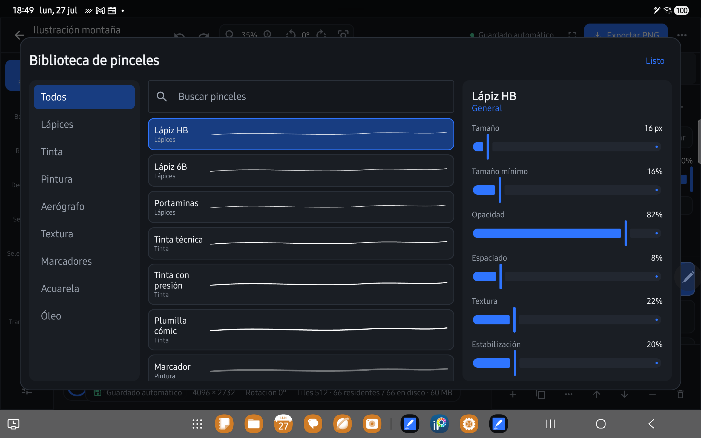
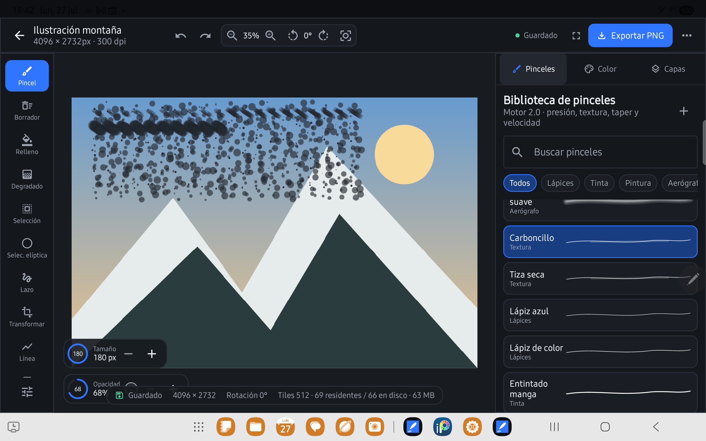

# Phase 6: Ink and brush experience

Canvas Studio keeps its tile-based raster engine as the document source of truth. For large textured brushes, an AndroidX Ink front buffer renders the active stroke at low latency while the engine commits the final deterministic raster stroke on pointer-up. This avoids rebuilding expensive texture stamps during every move event without changing the saved result.

The tablet brush library follows the supplied mockup: category navigation, search, a virtualized preset list, and a parameter inspector. Dedicated dry-brush, bristle, watercolor and oil stamp families make the listed presets materially different instead of merely changing a label.

## Validation on Galaxy Tab S8 (SM-X700)

- Raster instrumentation: 3/3 cycles passed; 600 strokes persisted in 6.44 seconds.
- Visual stress: 120 large Carboncillo strokes at 180 px; the app restored the document after reopening and no Canvas Studio crash was recorded in the successful run.
- The stress harness handles first-launch onboarding, retries transient UIAutomator reads, and filters the virtualized brush list by name.

`UiAutomationService already registered` can appear in Samsung logcat when a cancelled shell inspection overlaps another UI inspection. It is emitted by the device UIAutomator service, not Canvas Studio.

## Real-device captures

