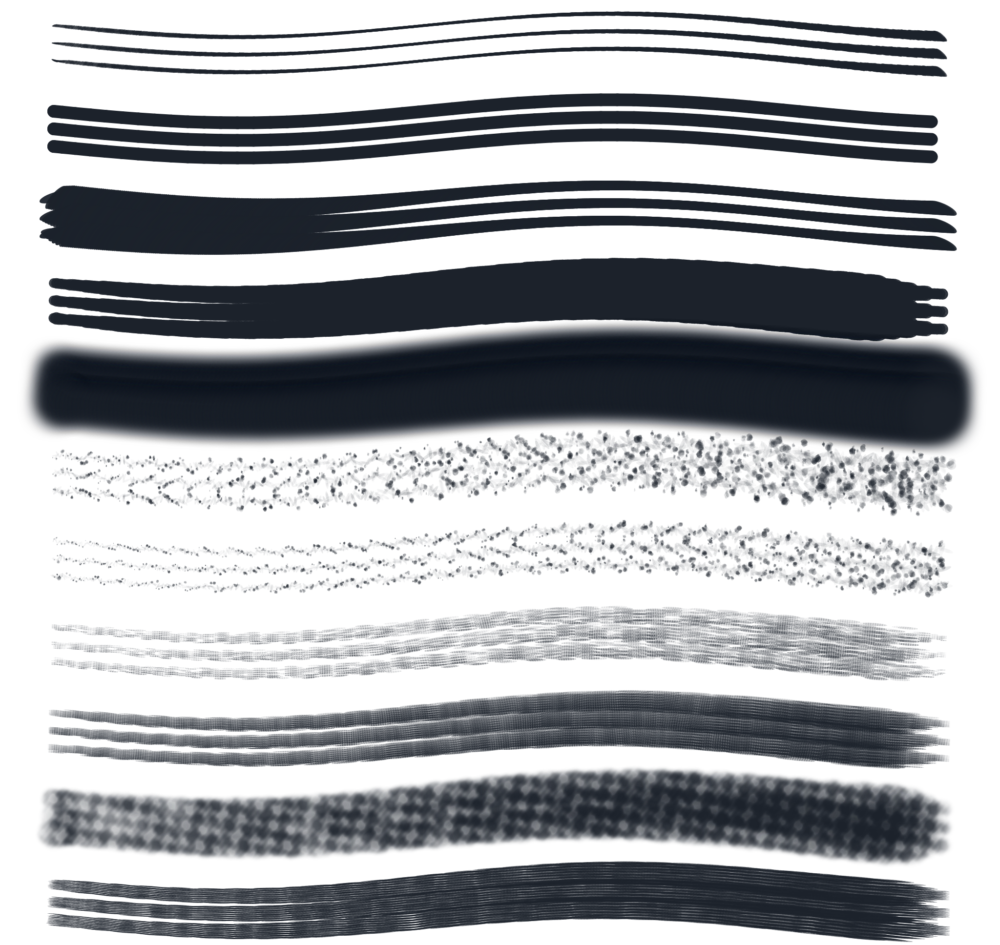

# Fase 9 — Motor de pinceles profesional

## Objetivo

Reemplazar los pinceles definidos principalmente por geometría codificada por perfiles combinables de punta, grano, render, medio e interacción con stylus.

## Investigación aplicada

La arquitectura toma como referencia conceptos documentados públicamente por motores profesionales:

- Procreate Brush Studio: una forma contiene un grano y se combina con Stroke Path, Taper, Rendering, Wet Mix, Dynamics y Apple Pencil.
- Procreate Shape/Grain: el grano texturizado permanece anclado a la superficie; el modo moving viaja con el trazo.
- Krita Pixel Brush Engine: spacing, opacity/flow y rotación son propiedades independientes de la punta.
- Android Stylus APIs: cada `MotionEvent` puede aportar presión, inclinación, orientación y muestras históricas.

Fuentes:

- https://help.procreate.com/procreate/handbook/5.3/brushes/brush-studio
- https://help.procreate.com/procreate/handbook/5.2/brushes/brush-studio-settings
- https://help.procreate.com/procreate/handbook/5.0/brushes/dual-brush
- https://docs.krita.org/en/reference_manual/brushes/brush_engines/pixel_brush_engine.html
- https://developer.android.com/develop/ui/views/touch-and-input/stylus-input
- https://developer.android.com/develop/ui/views/touch-and-input/gestures/movement

## Implementación

El motor 3.0 separa:

- punta: forma, redondez, ángulo, rotación y cantidad;
- grano: fuente, escala, profundidad, contraste y movimiento;
- render: veladura ligera, uniforme, intensa o mezcla;
- medio: acumulación, humedad, dilución y arrastre.

Los granos originales de papel fino, papel áspero, lienzo, cerda y acuarela se generan como tiles alfa periódicos. Sus bordes coinciden, evitando que aparezca una cuadrícula al repetir la textura.

El rasterizador:

- procesa presión, inclinación y orientación actuales e históricas;
- rota puntas según dirección, S Pen, ángulo fijo o variación determinista;
- convierte el lápiz en un pincel de stamps con punta ovalada;
- usa cantidades configurables de cerdas o partículas;
- aplica textura dentro de toda la huella;
- conserva límites adaptativos para pinceles grandes.

La biblioteca guarda los perfiles nuevos en JSON y conserva compatibilidad con pinceles antiguos.

## Editor y preview

La ventana de pinceles incorpora una sección **Material** con controles de punta, grano, acumulación, humedad y arrastre. El preview reacciona a estos parámetros además de tamaño, presión, taper, velocidad y dispersión.

## Validación inicial en Samsung Galaxy Tab S8

Dispositivo: Samsung SM-X700 conectado por USB.

- 11 familias conservaron el primer lote tras añadir trazos gruesos.
- HB modificado conservó trazos antiguos después de 64 trazos largos de 180 px.
- 200 trazos sobrevivieron flush, expulsión de caché y recarga de tiles.
- El segundo dedo no eliminó la obra confirmada.

La matriz completa debe repetirse después de cada modificación del rasterizador.

