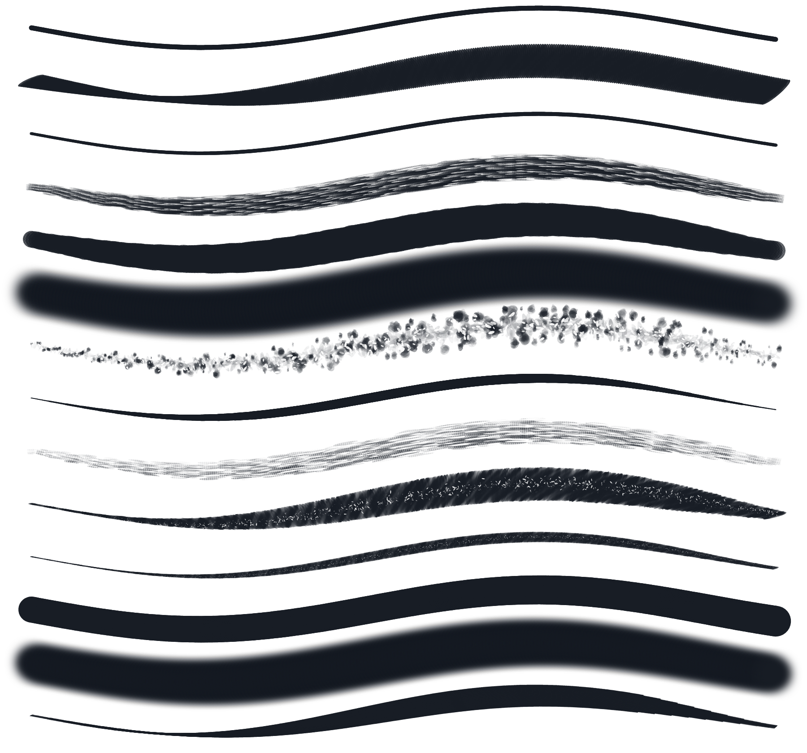

# Biblioteca profesional de pinceles 2.4

## Alcance

La auditoría parte de 30 IDs históricos. La biblioteca visible queda en 14 herramientas de producción; 4 medios complejos quedan ocultos en `Experimental` por defecto y 12 redundancias se resuelven mediante alias. Los presets personalizados y las colecciones importadas conservan todos sus parámetros. Canvas/Bitmap continúa como backend de producción y Vulkan experimental no amplía su alcance.

## Inventario y decisión

| Preset histórico | Material / uso | Presión · tilt · velocidad | Textura, borde y acumulación | Rendimiento / diferencia | Decisión y destino |
|---|---|---|---|---|---|
| Lápiz HB | grafito de boceto y tono medio | oscuridad/ancho graduales · sombreado lateral · estabilización ligera | grano fino anclado, borde leve, repaso gradual | ligero; más claro y firme que 6B | **REFINE** · producción |
| Lápiz 6B | grafito blando y sombreado | depósito alto · tilt ancho · velocidad conserva masa | grano marcado, borde suave, acumulación rápida | medio; claramente más oscuro que HB | **REFINE** · producción |
| Portaminas | detalle técnico | ancho casi fijo · tilt mínimo · respuesta rápida | trazo limpio, grano mínimo, acumulación baja | ligero; más fino que HB | **REFINE** · producción |
| Tinta técnica | lineart uniforme | presión estable · sin tilt · curvas rápidas limpias | sin grano, borde duro, negro uniforme | ligero; ancho más constante que plumilla | **REFINE** · producción |
| Tinta con presión | tinta expresiva | presión y taper altos · sin tilt | negro sólido, borde limpio | duplicaba plumilla cómic | **MERGE** → `comic-nib` |
| Plumilla cómic | lineart expresivo | ancho muy sensible · taper limpio · respuesta rápida | sin grano, borde duro, negro sólido | ligero; expresiva frente a técnica | **REFINE** · producción |
| Marcador | rotulador redondo para masas | presión de opacidad moderada · sin tilt | borde controlado, superposición coherente | ligero; redondo frente a plano | **REFINE** · producción |
| Gouache opaco | pintura cubriente | presión controla depósito · tilt moderado | grano de lienzo sutil, borde pictórico, masa opaca | medio; no difuso como aerógrafo | **REFINE** · producción |
| Pintura suave | veladura suave | presión/opacidad suaves · sin orientación útil | borde difuso y acumulación gradual | duplicaba aerógrafo suave | **MERGE** → `airbrush` |
| Aerógrafo suave | transiciones y volumen | presión gradual · sin tilt · velocidad uniforme | difusión continua sin grano ni stamps | medio en tamaño grande; más suave que duro | **REFINE** · producción |
| Carboncillo | masas y sombreado orgánico | presión y tilt amplios · velocidad rompe el borde | grano rugoso anclado, irregularidad controlada | medio; único material quebrado | **REFINE** · producción |
| Tiza seca | textura seca | presión y tilt medios | ruido rugoso y acumulación | duplicaba carboncillo | **MERGE** → `charcoal` |
| Lápiz azul | boceto coloreado | dinámica equivalente a HB | mismo grafito con color inicial | no aportaba comportamiento | **MERGE** → `pencil-hb` |
| Lápiz de color | dibujo coloreado | dinámica cercana a HB | grano intermedio | diferencia insuficiente | **MERGE** → `pencil-hb` |
| Entintado manga | lineart | presión alta y taper | tinta sólida sin grano | duplicaba plumilla | **MERGE** → `comic-nib` |
| Plumilla G | lineart expresivo | presión alta y taper | tinta sólida | duplicaba plumilla cómic | **MERGE** → `comic-nib` |
| Rotulador plano | caligrafía y masas orientadas | poca presión · orientación visible | punta plana, borde controlado, capas coherentes | ligero; distinto del marcador redondo | **REFINE** · producción |
| Aerógrafo duro | máscara suave con centro definido | presión gradual · sin tilt | borde firme sin grano, acumulación controlada | medio; transición más corta que suave | **REFINE** · producción |
| Pincel seco | arrastre con poca carga | presión abre el depósito · velocidad corta pintura | cortes de cerda no periódicos, borde roto | medio/alto; seco frente a cerdas cargadas | **REFINE** · producción |
| Pincel de cerdas | pintura con filamentos | presión y orientación mueven haces | cerdas múltiples, carga media, borde fibroso | alto pero acotado; más continuo que seco | **REFINE** · producción |
| Acuarela granulada | medio húmedo granulado | presión, tilt y velocidad experimentales | sangrado/grano aún digital en ciertos gestos | alto; motor aún no simula fluido completo | **HIDE** · Experimental |
| Óleo espeso | pintura viscosa | presión/deposito altos | textura de volumen aproximada | alto; sin iluminación material real | **HIDE** · Experimental |
| Lápiz 2H | detalle duro | poca variación | grano mínimo | duplicaba portaminas | **MERGE** → `mechanical-pencil` |
| Grafito inclinado | sombreado ancho | tilt alto | grafito rugoso | función cubierta por 6B | **MERGE** → `pencil-6b` |
| Tinta sumi | tinta orientada | presión/tilt medios | borde suave | función cubierta por caligrafía plana | **MERGE** → `calligraphy-flat` |
| Caligrafía plana | caligrafía orientada | presión moderada · orientación coherente | punta plana, negro sólido, sin grano | ligero; tercera tinta funcionalmente distinta | **REFINE** · producción |
| Pastel suave | masa texturada | presión y tilt medios | grano rugoso, borde quebrado | duplicaba carboncillo | **MERGE** → `charcoal` |
| Spray granulado | aerosol con partículas | presión gradual | dispersión visible | ruido menos controlable que aerógrafo duro | **MERGE** → `hard-airbrush` |
| Redondo húmedo | acuarela redonda | presión/deposito suaves | sangrado aproximado | motor húmedo incompleto | **HIDE** · Experimental |
| Cerda impasto | óleo de cerdas | presión, tilt y carga altos | relieve solo aproximado en raster RGBA | alto; falta modelo material | **HIDE** · Experimental |

No se usa `REMOVE`: los 30 IDs se mantienen resolubles para compatibilidad. `MERGE` y `HIDE` eliminan ruido de la biblioteca, no datos históricos.

## Biblioteca final

- **Lápices:** Lápiz HB, Lápiz 6B, Portaminas.
- **Tinta:** Tinta técnica, Plumilla cómic, Caligrafía plana.
- **Marcadores:** Marcador, Rotulador plano.
- **Pintura:** Gouache opaco, Pincel seco, Pincel de cerdas.
- **Textura:** Carboncillo.
- **Aerógrafos:** Aerógrafo suave, Aerógrafo duro.
- **Experimental, oculto por defecto:** Acuarela granulada, Redondo húmedo, Óleo espeso, Cerda impasto.
- **Personalizados:** sin cambios ni reducción.

## Previews y Brush Studio

`BrushPreviewModel` construye el preview mediante `BrushDabBatchBuilder`, `BrushEvaluator`, `BrushDab`, la semilla determinista, la punta, el grano y las curvas reales del preset. Los controles de grano, dual brush, tilt, taper y scatter se muestran solo cuando la familia los soporta. `BrushSettings.sanitized()` limita tamaño, spacing, opacidad, flow, scatter, grain, cantidad de puntas y parámetros de render antes de llegar al lienzo.

## Compatibilidad

`builtInBrushAliases` migra favoritos y recientes. `resolveBuiltInBrush()` conserva la resolución de IDs históricos. La serialización completa de pinceles `custom-*` no cambia, incluso cuando fueron derivados de un preset fusionado. Experimental es una preferencia local y empieza oculto.

## Certificación

Cada pincel de producción usa once escenarios deterministas: línea lenta/rápida, presión creciente/decreciente, curva, zigzag, círculos, tilt progresivo, sombreado, tres capas y cruce de cuatro tiles. La instrumentación genera láminas PNG individuales y una comparación ciega sin etiquetas.

Las 14 láminas individuales se conservan en [`docs/images/brush-certification`](images/brush-certification/).

### Resultado verificado — Galaxy Tab S8

- Dispositivo: Samsung `SM-X700`, Android 16, ADB USB.
- APK: `2.4.0-debug` (`versionCode 31`), SHA-256 `3813EB77CDD2AF91D45C4E728A109440AE6859F3B2664558DBC7E9C14B380C86`.
- Instrumentación: SHA-256 `6EDC529BE5720FD80397F5B797C141456E334AB3C5ACA47E3D5E4EFF292E0C43`.
- Catálogo, migración, previews, fixtures y tutorial: 37/37 en 17,787 s.
- Estrés específico: 500 trazos largos de lápiz con undo, guardado y reapertura; 200 trazos costosos; 2/2 en 36,756 s.
- Suite completa: 100/100 en 827,186 s, incluido el test continuo de diez minutos heredado.
- 500 lápices: 28.542 ms, `commandsExamined=1568`, `commandsReplayed=1568`, `indexFallbacks=0`, 12 checkpoints / 12 MiB dentro de un presupuesto de 17,92 MiB.
- 200 trazos costosos: 7.355 ms; trazo centinela inicial conservado.
- Gradle final: `check` 19 s, `assembleDebug` 9 s, `assembleDebugAndroidTest` 9 s.

La ruta instrumentada crea eventos con `TOOL_TYPE_STYLUS`, presión, tilt y orientación, pero no sustituye una sesión artística humana con el S Pen físico. Esa evaluación subjetiva se mantiene como validación manual previa a publicación; no se presenta como automatizada ni como ya completada.
