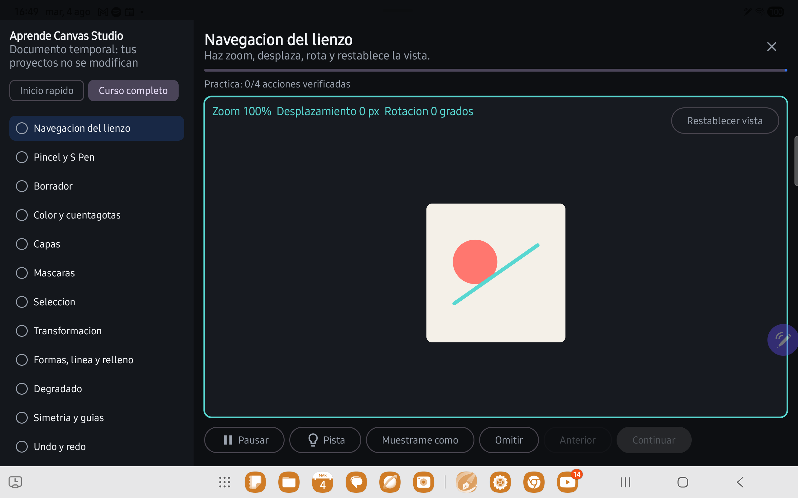
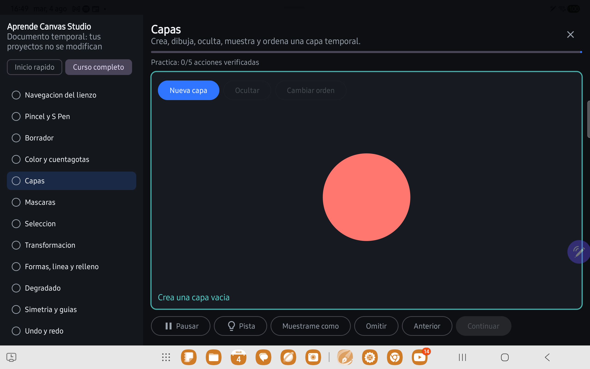
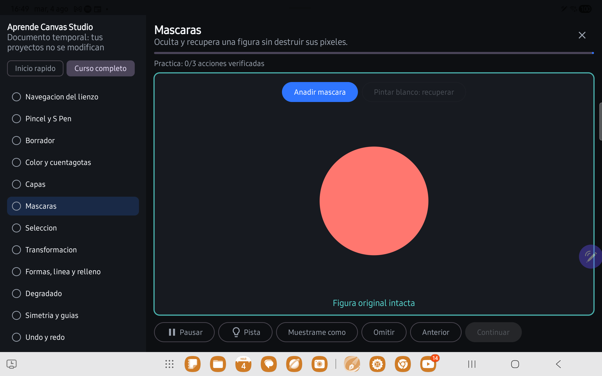
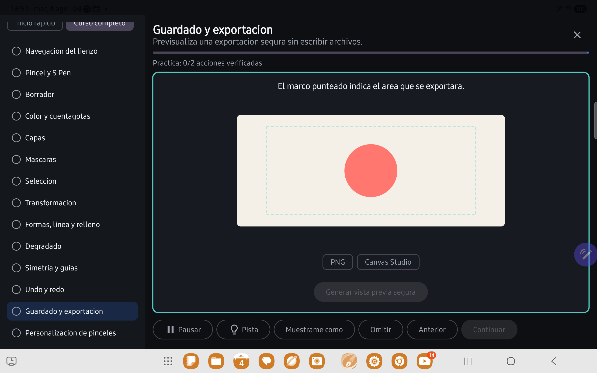
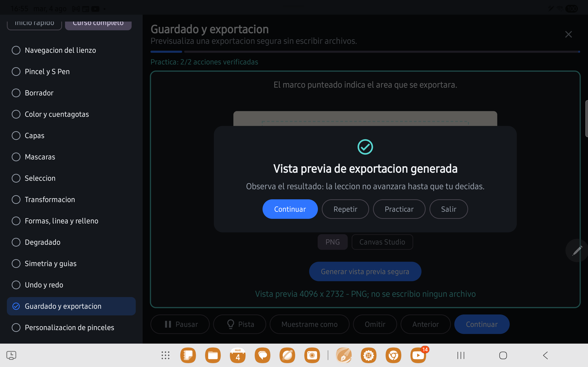

# Tutorial interactivo v2

Fecha de certificacion: 2026-08-04
Dispositivo objetivo: Samsung Galaxy Tab S8 (SM-X700), Android 16 / API 36
Alcance congelado: no se modifico el backend Vulkan, sus shaders, residencia GPU ni seleccion de backend.

## Auditoria de las 14 lecciones

La columna "resultado anterior" describe el comportamiento encontrado antes del rediseño. `REDESIGN` significa que la leccion conserva el objetivo, pero reemplaza su interaccion y validacion.

| # | Modulo | Instruccion anterior | Accion solicitada | Resultado visual esperado | Resultado anterior real | Evento anterior | Comprension probable | Decision |
|---|---|---|---|---|---|---|---|---|
| 1 | Navegacion | Pellizca y desplaza | Gesto de dos dedos | Zoom y desplazamiento medibles | Cambio de tarjeta sin rotacion ni reset | `CanvasZoomChanged` | Parcial: faltaba cerrar el ciclo | REDESIGN |
| 2 | Pincel y S Pen | Traza variando presion | Un trazo | Grosor, presion y tilt visibles | Trazo simple; podia completar pronto | `StrokeCommitted` | Parcial | REDESIGN |
| 3 | Borrador | Practica borrador | Un trazo | Pixeles visibles eliminados y recuperados | Lienzo inicialmente vacio | `StrokeCommitted(eraser)` | Baja | REDESIGN |
| 4 | Color | Usa cuentagotas | Pulsar boton | Color activo cambia y se usa | Solo boton; sin muestra ni trazo | `ColorPicked` | Baja | REDESIGN |
| 5 | Capas | Crea una capa | Pulsar boton | Nueva miniatura, contenido y visibilidad | Solo boton | `LayerCreated` | Baja | REDESIGN |
| 6 | Mascaras | Anade mascara | Pulsar boton | Miniatura, ocultacion y recuperacion | Solo boton | `MaskCreated` | Baja | REDESIGN |
| 7 | Seleccion | Crea seleccion | Pulsar boton | Contorno con area valida | Solo boton | `SelectionCommitted` | Baja | REDESIGN |
| 8 | Transformacion | Confirma transformacion | Pulsar boton | Preview geometrico y confirmacion | Solo boton | `TransformCommitted` | Baja | REDESIGN |
| 9 | Formas y relleno | Crea y rellena | Dos botones | Contorno y region cambiada | Secuencia de botones sin lienzo | `ShapeCommitted`, `FillCommitted` | Baja | REDESIGN |
| 10 | Degradado | Arrastra extremos | Pulsar boton | Inicio, direccion y longitud visibles | Solo boton | `GradientCommitted` | Baja | REDESIGN |
| 11 | Simetria y guias | Activa simetria | Pulsar boton | Eje y copia reflejada | Solo boton, sin trazo | `SymmetryEnabled` | Baja | REDESIGN |
| 12 | Undo/redo | Deshaz y recupera | Dos botones | Mismo trazo desaparece y vuelve | Botones sin trazo identificable | `UndoPerformed`, `RedoPerformed` | Parcial | REDESIGN |
| 13 | Guardado/exportacion | Prueba exportacion | Pulsar boton | Area, formato y miniatura segura | Solo boton | `ExportCompleted` | Baja | REDESIGN |
| 14 | Personalizacion | Cambia 3 parametros | Tres sliders | Preview y comparacion antes/despues | Conteo de cambios, sin diferencia exigida | `BrushCustomized` | Parcial | REDESIGN |

## Resultado implementado

Cada leccion sigue: explicacion breve -> foco semantico -> accion real en documento temporal -> cambio visible -> validacion de dominio -> confirmacion explicativa -> pausa de observacion -> eleccion explicita.

| Modulo | Ejercicio temporal | Evidencia requerida para completar | Confirmacion |
|---|---|---|---|
| Navegacion | Tarjeta con objetos reconocibles | zoom >= 10%, pan >= 24 px, rotacion >= 8 grados y reset | Vista transformada y restablecida |
| Pincel y S Pen | Guia de trazo con lectura de presion/tilt | trazo >= 48 px, presion suave, fuerte y rango >= 0.20 | La presion cambio el grosor |
| Borrador | Franja coral ya dibujada | borrado visible y recuperacion >= 32 px | Zona borrada y recuperada |
| Color | Cuatro muestras y lienzo | color distinto, color activo cambiado y trazo >= 48 px | Color muestreado y usado |
| Capas | Objeto base, miniatura y capa temporal | crear, dibujar, ocultar, mostrar y reordenar con cambio visual | Capa comprobada |
| Mascaras | Circulo coral preparado | crear mascara, ocultar area >= 256 px y recuperar >= 128 px | Pixeles originales conservados |
| Seleccion | Objeto claramente seleccionable | rectangulo con area >= 2.500 px | Seleccion valida creada |
| Transformacion | Objeto coral con preview | desplazamiento >= 24 px (o escala/rotacion minima) y confirmacion | Transformacion confirmada |
| Formas/relleno | Lienzo de figura | forma >= 2.500 px y relleno >= 500 pixeles | Figura creada y rellenada |
| Degradado | Guia inicial/final | longitud >= 72 px y diferencia de color >= 0.15 | Degradado visible aplicado |
| Simetria | Eje vertical temporal | guia visible y trazo >= 48 px con >= 2 copias | Trazo reflejado |
| Undo/redo | Trazo coral identificable | trazo, cambio visual al undo y restauracion del mismo ID | Trazo deshecho y restaurado |
| Exportacion | Marco del area y miniatura | formato valido y preview con dimensiones | Preview generado sin archivo real |
| Pincel | Trazos antes/despues | parametro cambia >= 0.15 y diferencia visible >= 0.15 | Comparacion completada |

## Flujo, recuperacion y accesibilidad

- La confirmacion permanece al menos 850 ms antes de ofrecer `Continuar`, `Repetir`, `Practicar` y `Salir`; no existe avance automatico.
- `Muestrame como` abre una demostracion que bloquea la validacion y exige que el usuario lo intente despues.
- Dos niveles de pista conservan evidencia util; reiniciar afecta solo la leccion actual y reconstruye su ejercicio.
- El foco usa anclas obtenidas por `onGloballyPositioned`, IDs semanticos y limites reales; no usa coordenadas fijas y la capa dibujada no consume toques.
- El pie es desplazable horizontalmente para mantener recuperacion y navegacion con fuente grande o ancho reducido.
- Los estados persistidos son `NOT_STARTED`, `IN_PROGRESS`, `COMPLETED` y `SKIPPED`, con paso, fecha y version por leccion.
- Un cambio de version invalida solo la leccion incompatible.
- `Inicio rapido` contiene navegacion, S Pen, borrador, capas, undo/redo y exportacion. `Curso completo` contiene los 14 modulos.
- Todo el contenido vive en estado Compose temporal y no recibe una referencia a `EditorDocument` ni a `ProjectRepository`.

## Evidencia automatizada

- `StudioTutorialStateTest`: 10 pruebas de dominio, umbrales, secuencias, recuperacion, progreso, migracion y 14/14 lecciones.
- `StudioTutorialUiTest`: 4 pruebas Compose de horizontal, vertical/fuente grande, semantica de confirmacion y demostracion no completante.
- Logs completos: `docs/test-results/tutorial-specific-tab-s8.txt` y `docs/test-results/tutorial-full-suite-tab-s8-final2.txt`.

## Revision manual Tab S8

Se abrieron y revisaron visualmente los 14 ejercicios reales en la Tab S8 mediante ADB y capturas 2560 x 1600. Tambien se completo de punta a punta la leccion de exportacion: formato -> preview -> pausa -> confirmacion -> acciones. Esa pasada descubrio una compresion del panel al abrir la confirmacion; se corrigio envolviendo contenido y dialogo en la misma raiz `Box`, se agrego una regresion de ancho y se repitio la evidencia en `tutorial-dialog-fixed.png`.

La entrada ADB de un solo puntero no puede reproducir presion/tilt reales del S Pen ni un gesto multitouch humano. Esos dos eventos se validaron con pruebas de dominio y no se presentan como una pasada artistica humana. La revision visual manual si comprobo instruccion, foco, ejercicios, controles de recuperacion, ausencia de superposiciones y legibilidad en los 14 modulos.

| Modulo | Instruccion | Foco | Cambio visible | Se observa | Validacion | Recuperacion | Ensenanza |
|---|---|---|---|---|---|---|---|
| Navegacion | OK | OK | OK automatizado | OK | Umbrales correctos | OK | Si; falta pasada humana multitouch |
| Pincel y S Pen | OK | OK | OK automatizado | OK | Umbrales correctos | OK | Si; falta pasada humana con presion/tilt |
| Borrador | OK | OK | OK | OK | Correcta | OK | Si |
| Color y cuentagotas | OK | OK | OK | OK | Correcta | OK | Si |
| Capas | OK | OK | OK | OK | Correcta | OK | Si |
| Mascaras | OK | OK | OK | OK | Correcta | OK | Si |
| Seleccion | OK | OK | OK | OK | Correcta | OK | Si |
| Transformacion | OK | OK | OK | OK | Correcta | OK | Si |
| Formas y relleno | OK | OK | OK | OK | Correcta | OK | Si |
| Degradado | OK | OK | OK | OK | Correcta | OK | Si |
| Simetria y guias | OK | OK | OK | OK | Correcta | OK | Si |
| Undo/redo | OK | OK | OK | OK | Correcta | OK | Si |
| Guardado/exportacion | OK | OK | OK | OK, 850 ms | Correcta | OK | Si, flujo completo en dispositivo |
| Personalizacion | OK | OK | OK | OK | Correcta | OK | Si |

### Capturas reales de la Tab S8

Curso completo y ejercicios temporales:

Exportacion segura y confirmacion corregida:

## Problemas conocidos

- Pendiente una segunda pasada humana con dos dedos y S Pen fisico para evaluar comprension subjetiva, presion y tilt; ADB no puede certificar esos matices humanos.
- El warning de CMake sobre SDK XML version 4 frente a herramientas que entienden hasta 3 sigue siendo externo al tutorial y no bloquea compilacion.
