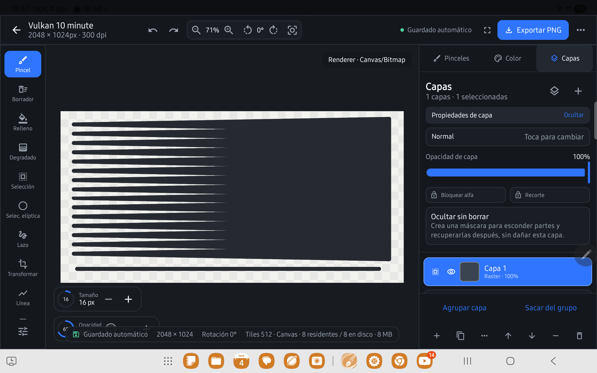

# Tutorial interactivo integrado · Canvas Studio 2.4.0

Fecha de certificación: 2026-08-04

Dispositivo: Samsung Galaxy Tab S8 (`SM-X700`)

Android: 16 / API 36

APK validada: `2.4.0-debug` (`versionCode 31`)

## Arquitectura actual

El tutorial ya no depende únicamente de una pantalla de práctica aislada. Abre un documento temporal de `2048 × 1536` dentro de `EditorScreen` y utiliza el editor, herramientas, paneles, capas y renderer reales.

- siempre comienza en `1/14 · Navegación del lienzo` sin reutilizar evidencia antigua;
- no abre proyectos locales ni guarda el documento de práctica;
- los cambios de herramienta, color, capa, máscara, selección, transformación e historial generan eventos reales del dominio;
- exportar durante la lección produce una preview segura y no escribe un archivo;
- cada paso avanza únicamente cuando aparece la evidencia requerida;
- el botón `Continuar` solo aparece cuando la lección actual está completa.

## Foco contextual y ausencia de bloqueos

Los controles relevantes exponen anclas semánticas mediante `onGloballyPositioned`. Sus límites se convierten al sistema de coordenadas del overlay antes de dibujar el foco.

La tarjeta de instrucciones ya no permanece fija en la parte inferior:

- un objetivo situado en el panel derecho mueve la tarjeta al lado izquierdo;
- un objetivo bajo mueve la tarjeta a la parte superior;
- al cambiar de paso se descartan inmediatamente los límites del objetivo anterior;
- `Minimizar` reduce la tarjeta a `Mostrar guía` para dejar libre el lienzo;
- el overlay visual no consume las acciones destinadas al editor.

Estas reglas corrigen la superposición que impedía tocar visibilidad de capa u otros controles laterales.

## Máscaras: lenguaje orientado al resultado

La función se presenta como **Ocultar sin borrar** antes de introducir el término técnico máscara.

1. `Ocultar` activa la edición de máscara y selecciona Pincel.
2. Pintar esconde partes de la capa sin modificar sus píxeles originales.
3. `Recuperar` mantiene la máscara activa y selecciona Borrador.
4. Borrar sobre la máscara vuelve a mostrar la zona oculta.
5. `Mostrar original` permite comparar temporalmente sin eliminar la ocultación.
6. `Quitar ocultación` elimina la máscara, no el contenido original.

Contenido y máscara permanecen como superficies raster distintas en historial, tiles y persistencia.



## Lecciones y evidencia

| # | Lección | Evidencia principal |
|---|---|---|
| 1 | Navegación | zoom, desplazamiento, rotación y restablecimiento |
| 2 | Pincel y S Pen | trazo real con rango de presión |
| 3 | Borrador | contenido borrado y recuperado con Deshacer |
| 4 | Color | color muestreado y utilizado en un trazo |
| 5 | Capas | crear, dibujar, ocultar, mostrar y reordenar |
| 6 | Ocultar sin borrar | crear máscara, ocultar y recuperar contenido |
| 7 | Selección | área rectangular válida |
| 8 | Transformación | selección previa, preview y confirmación |
| 9 | Formas y relleno | rectángulo y relleno real |
| 10 | Degradado | dirección y longitud válidas |
| 11 | Simetría | guía visible y trazo con copias |
| 12 | Deshacer/Rehacer | mismo trazo eliminado y restaurado |
| 13 | Exportación | formato y preview con dimensiones del documento |
| 14 | Personalización | tamaño modificado y trazo comparativo |

## Evidencia automatizada

Comandos Gradle aprobados:

```powershell
.\gradlew.bat check assembleDebug assembleDebugAndroidTest
```

Resultados en la Tab S8:

- `EditorTutorialIntegrationTest`: 9/9;
- suite instrumentada completa: 116/116;
- duración completa: `808,15 s`;
- sesión continua real: diez minutos;
- proceso ADB: código de salida `0`;
- fallos del tutorial o máscaras: `0`.

La suite completa también cubrió 500 trazos largos, 200 trazos gruesos, cruce de cuatro tiles, historial escalable, máscaras y el backend Vulkan experimental.

Log preservado: [`test-results/tutorial-editor-full-suite-tab-s8-2.4.txt`](test-results/tutorial-editor-full-suite-tab-s8-2.4.txt).

## Alcance de la revisión manual

La revisión más reciente comprobó en el editor real:

- inicio limpio en la lección 1;
- foco alineado con el lienzo después de descontar el inset superior;
- contador inicial sin evidencia generada por el reset interno;
- panel de capas y texto **Ocultar sin borrar**;
- instalación final de la APK y ejecución de las regresiones en `SM-X700`.

Presión, inclinación y comprensión subjetiva de gestos multitouch requieren interacción humana con el S Pen; ADB no sustituye esa evaluación. La corrección técnica de esos eventos está cubierta por instrumentación.

## Límites

- El progreso del tutorial es aceleración de sesión y no forma parte del formato del proyecto.
- El documento temporal no aparece en la galería.
- No se afirma equivalencia con tutoriales o motores propietarios de otras aplicaciones.
